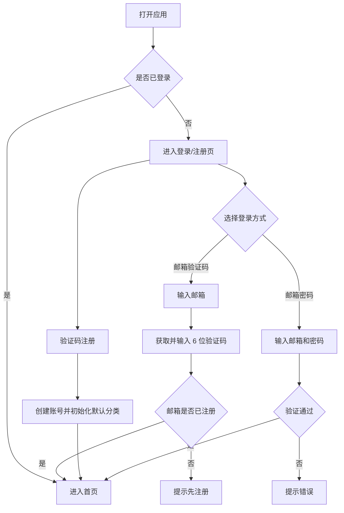
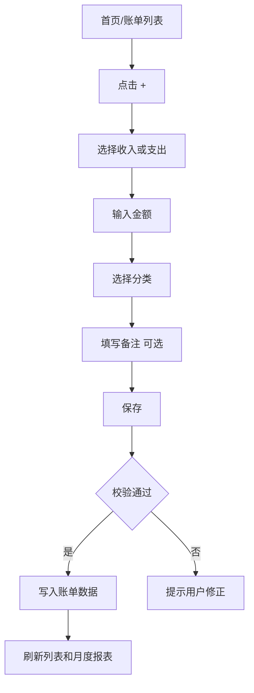
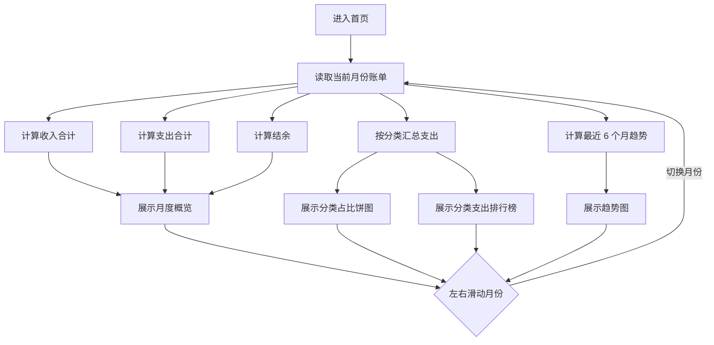

# 个人记账本 PRD

## 一、项目背景与目标

### 1.1 项目背景

个人记账本是一款轻量级、移动端优先的个人记账 Web 应用，面向 22-35 岁年轻人群，包括职场新人、学生、自由职业者等。目标用户希望快速记录日常收入与支出，并通过月度报表了解个人消费结构，从而辅助预算控制和消费复盘。

### 1.2 产品定位

轻量级、移动端优先的个人记账 Web 应用，支持多用户注册登录，用户数据在云端隔离存储。

### 1.3 核心价值

- 快速记录：用户可在短时间内完成一笔收入或支出记录。
- 自动归类：提供默认分类，降低首次使用成本。
- 可视化洞察：通过月度统计和分类占比帮助用户理解消费结构。
- 消费预警：围绕预算控制提供提醒能力。

### 1.4 项目目标

- 支持用户通过邮箱注册、登录和退出登录。
- 支持用户创建、查看、编辑、删除收支记录。
- 支持系统预置常用分类，并允许用户添加自定义分类。
- 支持首页展示当月收入合计、支出合计和结余。
- 支持月度报表展示分类支出占比，并可切换月份查看历史趋势。
- 确保不同用户之间的数据相互隔离。

## 二、用户角色

| 角色 | 说明 | 主要诉求 |
| --- | --- | --- |
| 新用户 | 首次使用产品的用户 | 快速完成注册并获得可用的默认分类，无需复杂配置即可开始记账 |
| 老用户 | 已注册并持续使用产品的用户 | 支持多种登录方式，快速进入应用并管理历史账单 |
| 普通用户 | 已登录的记账用户 | 快速新增、浏览、编辑、删除账单，查看月度统计和消费结构 |
| 公共设备使用者 | 在共享设备上使用产品的用户 | 使用后可一键退出登录，避免财务隐私泄露 |

## 三、用户故事

### 3.1 注册与登录

| 编号 | 角色 | 用户故事 |
| --- | --- | --- |
| US-01 | 新用户 | 作为新用户，我希望输入邮箱和 6 位验证码即可完成注册，以便快速开始记账，无需记忆密码。 |
| US-02 | 老用户 | 作为老用户，我希望可以用“邮箱 + 密码”或“邮箱 + 验证码”两种方式登录，以便在不同场景下灵活选择。 |
| US-03 | 任何用户 | 作为任何用户，我希望在公共设备上使用后能一键退出登录，以便保护财务隐私。 |

### 3.2 收支记录

| 编号 | 角色 | 用户故事 |
| --- | --- | --- |
| US-04 | 用户 | 我希望点击“+”按钮输入金额、选择分类、填写备注（选填）即可保存一笔账单，以便 3 秒内完成记账。 |
| US-05 | 用户 | 我希望在账单列表左滑可删除、长按可编辑，以便修正填错的内容。 |
| US-06 | 任何用户 | 作为任何用户，我希望每笔账单清晰显示金额、分类、日期、备注，以便快速浏览无需点开详情。 |
| US-13 | 用户 | 我希望可以按月份、分类、收入/支出类型筛选账单，以便在历史账单较多时快速定位记录。 |

### 3.3 分类管理

| 编号 | 角色 | 用户故事 |
| --- | --- | --- |
| US-07 | 新用户 | 作为新用户，我希望首次登录后自动拥有预设分类（餐饮、交通、购物、娱乐、住房、收入），以便开箱即用。 |
| US-08 | 用户 | 我希望可以添加自定义分类（如“设计设备”），以便匹配实际收支场景。 |
| US-09 | 任何用户 | 作为任何用户，我希望各用户的分类相互独立，互不影响。 |
| US-14 | 用户 | 我希望可以编辑或停用自定义分类，以便长期维护符合自己消费习惯的分类体系。 |

### 3.4 月度报表

| 编号 | 角色 | 用户故事 |
| --- | --- | --- |
| US-10 | 用户 | 我希望首页默认展示当月收入合计、支出合计和结余，以便一目了然掌握本月财务概况。 |
| US-11 | 任何用户 | 作为任何用户，我希望看到各分类支出占比的饼图，以便直观了解“钱花在哪里”。 |
| US-12 | 用户 | 我希望通过左右滑动切换查看不同月份，以便回顾历史消费趋势。 |
| US-15 | 用户 | 我希望在饼图旁看到分类支出排行榜，以便不依赖颜色也能快速识别主要支出项。 |
| US-16 | 用户 | 我希望查看最近 6 个月的收入、支出和结余趋势，以便判断消费变化。 |

## 四、功能列表

### 4.1 账号与登录

| 功能 | 优先级 | 说明 |
| --- | --- | --- |
| 邮箱验证码注册 | P0 | 用户输入邮箱和 6 位验证码完成注册。 |
| 邮箱密码登录 | P0 | 已注册用户可使用邮箱和密码登录。 |
| 邮箱验证码登录 | P0 | 已注册用户可使用邮箱和 6 位验证码登录。 |
| 退出登录 | P0 | 用户可一键退出当前账号。 |
| 账号注销 | 待确认 | 是否支持删除账号及其全部数据，需要产品确认。 |

### 4.2 收支记录

| 功能 | 优先级 | 说明 |
| --- | --- | --- |
| 新增账单 | P0 | 点击“+”后输入金额、选择收支类型和分类，可选填写备注，保存账单。 |
| 账单列表 | P0 | 展示金额、分类、日期、备注等核心信息。 |
| 账单筛选 | P1 | 支持按月份、分类、收入/支出类型筛选账单；备注搜索和金额范围搜索作为后续增强。 |
| 编辑账单 | P0 | 通过长按账单进入编辑状态，支持修改金额、分类、日期、备注。 |
| 删除账单 | P0 | 通过左滑账单触发删除。 |
| 账单日期 | P0 | 默认使用当前日期，允许用户在编辑时调整日期。 |

### 4.3 分类管理

| 功能 | 优先级 | 说明 |
| --- | --- | --- |
| 默认分类初始化 | P0 | 新用户首次登录后自动生成餐饮、交通、购物、娱乐、住房、收入等分类。 |
| 自定义分类 | P1 | 用户可新增自定义分类。 |
| 用户分类隔离 | P0 | 每个用户拥有独立分类数据，互不影响。 |
| 分类编辑 | P1 | 用户可编辑自定义分类名称和类型；默认分类不允许改名。 |
| 分类停用 | P1 | 用户可停用自定义分类；已有账单引用该分类时保留历史展示，不做物理删除。 |

### 4.4 首页与月度报表

| 功能 | 优先级 | 说明 |
| --- | --- | --- |
| 月度收支概览 | P0 | 首页默认展示当月收入合计、支出合计和结余。 |
| 分类支出占比饼图 | P0 | 展示当前月份各支出分类占比。 |
| 分类支出排行榜 | P1 | 在饼图旁展示分类名称、金额和占比，按金额从高到低排序。 |
| 月份切换 | P0 | 支持左右滑动切换月份，查看历史消费趋势。 |
| 近 6 个月趋势 | P1 | 展示最近 6 个月收入、支出、结余趋势。 |
| 消费预警 | P1 | 根据预算配置触发提醒，具体规则待补充。 |

### 4.5 数据隔离与存储

| 功能 | 优先级 | 说明 |
| --- | --- | --- |
| 多用户数据隔离 | P0 | 用户只能访问自己的账单、分类和报表数据。 |
| 云端存储 | P0 | 数据存储在服务端，支持跨设备登录后访问。 |

## 五、业务流程图（可选）

### 5.1 注册/登录流程



### 5.2 新增账单流程



### 5.3 月度报表流程



## 六、UI 原型或者布局图

### 6.1 移动端首页

```text
+------------------------------------------------+
| 个人记账本                              退出   |
+------------------------------------------------+
| < 2026年06月 >                                  |
|                                                |
| 收入        支出        结余                    |
| ¥8,000      ¥3,260      ¥4,740                 |
+------------------------------------------------+
| 分类支出占比                                    |
|                                                |
|              [饼图区域]                         |
|                                                |
| 支出排行                                        |
| 1 餐饮 35% ¥1,141   2 购物 28% ¥913            |
+------------------------------------------------+
| 近6个月趋势                                     |
|              [收入/支出/结余折线图]             |
+------------------------------------------------+
| 最近账单                                        |
|                                                |
| 餐饮        午餐                 -¥38  今天     |
| 交通        地铁                 -¥6   今天     |
| 收入        工资                 +¥8000 06-01   |
|                                                |
|                                      [+]        |
+------------------------------------------------+
```

### 6.2 新增/编辑账单页

```text
+------------------------------------------------+
| 取消                 新增账单             保存 |
+------------------------------------------------+
| 类型      [ 支出 ] [ 收入 ]                     |
| 金额      ¥ 0.00                                |
| 分类      餐饮  交通  购物  娱乐  住房  更多    |
| 日期      2026-06-30                            |
| 备注      选填，例如：午餐                      |
+------------------------------------------------+
```

### 6.3 登录/注册页

```text
+------------------------------------------------+
| 个人记账本                                      |
|                                                |
| 邮箱                                           |
| [ user@example.com                         ]   |
|                                                |
| 登录方式                                       |
| [ 验证码登录 ] [ 密码登录 ]                    |
|                                                |
| 验证码 / 密码                                  |
| [ 6 位验证码                            获取 ] |
|                                                |
| [ 登录 / 注册 ]                                |
+------------------------------------------------+
```

### 6.4 分类管理页

```text
+------------------------------------------------+
| 分类管理                                  完成 |
+------------------------------------------------+
| 默认分类                                        |
| 餐饮     交通     购物     娱乐     住房        |
| 收入                                            |
|                                                |
| 自定义分类                                      |
| 设计设备                                        |
|                                                |
| [+ 添加分类]                                    |
+------------------------------------------------+
```

## 七、验收标准

### 7.1 注册与登录

- 用户输入合法邮箱和 6 位验证码后，可以完成注册并进入首页。
- 已注册用户可以通过邮箱密码登录。
- 已注册用户可以通过邮箱验证码登录。
- 用户点击退出登录后，当前会话失效，再次访问需要重新登录。
- 不同用户登录后只看到自己的账单、分类和报表数据。

### 7.2 收支记录

- 用户点击“+”可以打开新增账单页或弹层。
- 用户填写金额、分类、日期并保存后，账单出现在列表中。
- 备注为选填项，不填写备注也可保存账单。
- 单笔账单需要展示金额、分类、日期、备注。
- 用户可以按月份、分类、收入/支出类型筛选账单。
- 用户左滑账单可以删除该账单。
- 用户长按账单可以编辑该账单。
- 新增、编辑、删除账单后，首页月度统计和分类占比需要同步更新。

### 7.3 分类管理

- 新用户首次进入应用后，系统自动生成餐饮、交通、购物、娱乐、住房、收入分类。
- 用户可以新增自定义分类。
- 用户可以编辑自定义分类。
- 用户可以停用自定义分类；停用后不再出现在新增账单分类选择中，但历史账单仍展示原分类名称。
- 默认分类不允许编辑或停用。
- 用户新增的分类只对当前用户可见。
- 不同用户的分类数据互不影响。

### 7.4 月度报表

- 首页默认展示当前月份的收入合计、支出合计和结余。
- 支出分类占比以饼图展示。
- 饼图旁需要展示分类支出排行榜，包含分类名称、支出金额、占比。
- 用户左右滑动月份后，收入、支出、结余和饼图数据更新为目标月份。
- 用户可以查看最近 6 个月收入、支出、结余趋势。
- 无账单月份应展示 0 收入、0 支出、0 结余，并展示空状态。

### 7.5 消费预警

- 当用户配置预算后，系统应能基于预算规则触发提醒。
- 预算维度、提醒阈值和提醒方式待确认后补充验收细则。

## 八、边界条件

### 8.1 账号相关

- 邮箱格式不合法时，应提示用户修正。
- 邮箱需统一转为小写并去除首尾空格后再存储和匹配。
- 验证码必须为 6 位数字，错误或过期时应提示重新获取。
- 验证码有效期为 5 分钟，使用后立即失效，不允许重复使用。
- 同一邮箱验证码发送间隔为 60 秒；同一邮箱每小时最多发送 5 次，同一 IP 每小时最多发送 20 次。
- 同一邮箱验证码连续错误 5 次后，锁定验证码登录 15 分钟。
- 密码登录失败时，不应暴露账号是否存在等敏感信息。
- 密码长度至少 8 位，需包含字母和数字；弱密码应提示用户更换。
- 公共设备退出登录后，浏览器刷新或重新打开不应自动进入账户。
- 验证码登录时邮箱未注册不自动创建账号，需走注册流程。

### 8.2 账单相关

- 金额不能为空，且必须大于 0。
- 金额最多支持 2 位小数；输入超过 2 位小数时前端提示修正，后端拒绝保存。
- 单笔账单金额上限为 9,999,999.99 元。
- 金额输入不允许负数、科学计数法、非数字字符和超大整数。
- 备注为空时，列表中可不展示备注或展示默认占位，具体样式由 UI 设计确定。
- 删除账单前是否二次确认待确认；若不二次确认，应提供短时间撤销能力。
- 账单日期允许选择历史日期；是否允许未来日期待确认。

### 8.3 分类相关

- 默认分类不可重复初始化。
- 自定义分类名称不能为空。
- 自定义分类名称去除首尾空格后保存，最长 12 个中文字符或 24 个英文字符。
- 同一用户、同一收支类型下分类名称不允许重复。
- 默认分类不允许编辑或停用。
- 自定义分类停用后不再出现在新增/编辑账单分类选择中；历史账单继续展示原分类名称。

### 8.4 报表相关

- 无支出数据时，饼图区域应展示空状态。
- 跨月份切换时，所有统计口径需以账单日期为准。
- 收入分类不应计入支出占比饼图。

### 8.5 多用户与数据隔离

- 所有账单、分类、报表查询必须带用户身份范围。
- 用户不得通过接口访问、编辑或删除其他用户的数据。

### 8.6 待确认事项

以下问题需要产品侧确认后再进入详细设计或开发：

1. 注册时是否必须设置密码，还是仅验证码即可？
2. 是否支持账户注销，并删除所有数据？
3. 默认货币为人民币，是否支持切换其他币种？
4. 消费预警的预算维度是什么：月总支出、单分类预算，还是两者都支持？
5. 消费预警的触发阈值和通知方式是什么？
6. 删除账单是否需要二次确认或撤销机制？
7. 是否允许记录未来日期账单？

已按评审建议锁定的事项：

- 验证码登录时邮箱未注册不自动创建账号，需走注册流程。
- 支持编辑自定义分类和停用自定义分类；默认分类不允许编辑或停用。
- 自定义分类区分收入分类与支出分类。

## 九、非功能性需求

### 9.1 性能

- 移动端首页首次有效内容加载建议控制在 2 秒内。
- 新增账单保存成功后的列表和统计刷新应在 1 秒内完成。
- 月份切换后报表数据应在 1 秒内完成更新，弱网场景需展示加载状态。

### 9.2 可用性

- 核心记账路径应尽量短，目标是用户 3 秒内完成一笔常用账单记录。
- 移动端优先适配，主要交互包括点击、左滑、长按、左右滑动切换月份。
- 关键操作失败时需给出明确提示，例如验证码错误、保存失败、网络异常。

### 9.3 安全与隐私

- 用户数据必须按账号隔离。
- 密码不得明文存储。
- 验证码需设置有效期和重发间隔。
- 登录失败需进行频控，连续失败后临时锁定登录能力。
- Access Token 有效期为 30 分钟；长期登录通过 Refresh Token 实现。
- Refresh Token 有效期为 7 天，刷新时轮换；退出登录时服务端使当前 Refresh Token 失效。
- 退出登录后应清除本地会话状态。
- 财务数据传输应使用 HTTPS。

### 9.4 兼容性

- Web 应用应优先适配移动端浏览器。
- 推荐支持最近两个主版本的 Chrome、Safari、Edge。
- 页面布局需适配常见手机屏幕宽度。

### 9.5 可维护性

- 账单、分类、用户、报表统计应有清晰的数据模型边界。
- 报表统计逻辑应可复用，避免前后端统计口径不一致。
- 待确认事项确认后，应同步更新 PRD、验收标准和边界条件。
