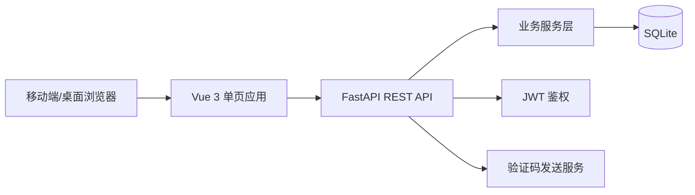

# 个人记账本技术设计文档

## 1. 文档目标

本文档基于 [PRD.md](/Users/wanglixiang/Documents/bill-account/PRD.md)，定义个人记账本的技术设计、实施计划和验证清单。

技术栈固定为：

- 后端：FastAPI
- 前端：Vue 3
- 数据库：SQLite

## 2. 需求范围

### 2.1 本期范围

- 邮箱验证码注册/登录
- 邮箱密码登录
- 退出登录
- 多用户数据隔离
- 默认分类初始化
- 自定义分类新增
- 自定义分类编辑和停用
- 账单新增、列表、编辑、删除
- 账单按月份、分类、收入/支出类型筛选
- 首页当月收入、支出、结余统计
- 分类支出占比饼图
- 分类支出排行榜
- 最近 6 个月收入、支出、结余趋势
- 月份切换查看历史账单和报表

### 2.2 暂缓或待确认范围

- 账号注销
- 多币种
- 消费预警的具体规则
- 未来日期账单
- 删除账单二次确认或撤销机制
- 备注全文搜索和金额范围搜索

## 3. 总体架构

### 3.1 架构图



### 3.2 分层设计

| 层级 | 技术/模块 | 职责 |
| --- | --- | --- |
| 前端页面层 | Vue 3 + Vue Router | 登录、首页、账单编辑、分类管理等页面 |
| 前端状态层 | Pinia | 用户会话、账单筛选月份、分类缓存 |
| 前端请求层 | Axios/fetch | 统一 API 请求、Token 注入、错误处理 |
| 后端接口层 | FastAPI Router | 暴露 REST API，处理请求参数和响应 |
| 后端业务层 | Service | 登录注册、账单、分类、报表统计 |
| 后端数据层 | SQLAlchemy ORM | SQLite 数据读写、事务管理 |
| 鉴权层 | JWT | 登录态签发、校验、退出后的前端清理 |

## 4. 推荐项目结构

```text
bill-account/
  backend/
    app/
      main.py
      core/
        config.py
        security.py
        database.py
      models/
        user.py
        category.py
        transaction.py
        verification_code.py
      schemas/
        auth.py
        category.py
        transaction.py
        report.py
      routers/
        auth.py
        categories.py
        transactions.py
        reports.py
      services/
        auth_service.py
        category_service.py
        transaction_service.py
        report_service.py
      tests/
    requirements.txt
  frontend/
    src/
      api/
        auth.ts
        categories.ts
        transactions.ts
        reports.ts
      stores/
        auth.ts
        ledger.ts
      views/
        LoginView.vue
        HomeView.vue
        CategoryView.vue
      components/
        MonthSwitcher.vue
        SummaryPanel.vue
        TransactionList.vue
        TransactionEditor.vue
        CategoryPieChart.vue
      router/
        index.ts
      main.ts
    package.json
  PRD.md
  SPEC.md
```

## 5. 后端技术设计

### 5.1 核心依赖

| 依赖 | 用途 |
| --- | --- |
| fastapi | Web API 框架 |
| uvicorn | ASGI 服务 |
| sqlalchemy | ORM 和数据库访问 |
| pydantic | 请求/响应模型校验 |
| python-jose 或 PyJWT | JWT 签发与解析 |
| passlib[bcrypt] | 密码哈希 |
| aiosmtplib 或本地 mock | 邮箱验证码发送 |
| pytest | 自动化测试 |

### 5.2 鉴权策略

- 登录成功后返回 JWT access token，并通过 HttpOnly Cookie 写入 refresh token。
- Access token 有效期为 30 分钟，用于访问受保护 API。
- Refresh token 有效期为 7 天，仅用于刷新 access token；每次刷新时轮换 refresh token。
- 前端将 access token 存储在内存或 sessionStorage；refresh token 固定使用 HttpOnly、Secure、SameSite=Lax Cookie。
- 所有账单、分类、报表接口必须通过 `Authorization: Bearer <access_token>` 访问。
- 后端从 access token 解析 `user_id`，所有查询和写入都必须带 `user_id` 条件。
- 退出登录时前端清理本地会话，同时调用服务端退出接口使当前 refresh token 失效并清除 Cookie。
- 密码登录和验证码登录连续失败需计数；同一邮箱连续失败 5 次后锁定登录 15 分钟。

### 5.3 验证码策略

- 验证码为 6 位数字。
- 验证码有效期为 5 分钟。
- 验证码使用后立即写入 `consumed_at`，不允许重复使用。
- 同一邮箱验证码发送间隔为 60 秒。
- 同一邮箱每小时最多发送 5 次验证码；同一 IP 每小时最多发送 20 次验证码。
- 同一邮箱验证码连续错误 5 次后，锁定验证码登录 15 分钟。
- 验证码登录时如果邮箱未注册，不自动创建账号，返回统一错误提示并引导用户注册。
- 开发环境可使用日志打印验证码或固定 mock 验证码。
- 生产环境需要接入真实邮件服务。

## 6. 数据库设计

### 6.1 users 用户表

| 字段 | 类型 | 约束 | 说明 |
| --- | --- | --- | --- |
| id | INTEGER | PK | 用户 ID |
| email | VARCHAR(255) | UNIQUE, NOT NULL | 邮箱 |
| password_hash | VARCHAR(255) | NULL | 密码哈希；若允许纯验证码注册，可为空 |
| failed_login_count | INTEGER | NOT NULL, DEFAULT 0 | 连续登录失败次数 |
| locked_until | DATETIME | NULL | 登录锁定截止时间 |
| created_at | DATETIME | NOT NULL | 创建时间 |
| updated_at | DATETIME | NOT NULL | 更新时间 |

邮箱写入前必须去除首尾空格并转为小写。

### 6.2 verification_codes 验证码表

| 字段 | 类型 | 约束 | 说明 |
| --- | --- | --- | --- |
| id | INTEGER | PK | 验证码记录 ID |
| email | VARCHAR(255) | INDEX, NOT NULL | 邮箱 |
| code_hash | VARCHAR(255) | NOT NULL | 验证码哈希 |
| purpose | VARCHAR(32) | NOT NULL | register/login |
| request_ip | VARCHAR(64) | NULL | 请求 IP，用于频控 |
| failed_attempts | INTEGER | NOT NULL, DEFAULT 0 | 该验证码校验失败次数 |
| expires_at | DATETIME | NOT NULL | 过期时间 |
| consumed_at | DATETIME | NULL | 使用时间 |
| created_at | DATETIME | NOT NULL | 创建时间 |

### 6.3 refresh_tokens 刷新令牌表

| 字段 | 类型 | 约束 | 说明 |
| --- | --- | --- | --- |
| id | INTEGER | PK | 刷新令牌记录 ID |
| user_id | INTEGER | FK, INDEX, NOT NULL | 所属用户 |
| token_hash | VARCHAR(255) | UNIQUE, NOT NULL | Refresh token 哈希 |
| expires_at | DATETIME | NOT NULL | 过期时间 |
| revoked_at | DATETIME | NULL | 主动失效时间 |
| replaced_by_id | INTEGER | FK, NULL | 轮换后的新令牌 ID |
| created_at | DATETIME | NOT NULL | 创建时间 |

### 6.4 categories 分类表

| 字段 | 类型 | 约束 | 说明 |
| --- | --- | --- | --- |
| id | INTEGER | PK | 分类 ID |
| user_id | INTEGER | FK, INDEX, NOT NULL | 所属用户 |
| name | VARCHAR(64) | NOT NULL | 分类名称 |
| type | VARCHAR(16) | NOT NULL | income/expense |
| is_default | BOOLEAN | NOT NULL | 是否默认分类 |
| is_active | BOOLEAN | NOT NULL, DEFAULT TRUE | 是否可用于新增/编辑账单 |
| deactivated_at | DATETIME | NULL | 停用时间 |
| created_at | DATETIME | NOT NULL | 创建时间 |
| updated_at | DATETIME | NOT NULL | 更新时间 |

建议唯一约束：

```text
UNIQUE(user_id, type, name)
```

分类删除采用“停用”而不是物理删除。停用分类不再出现在新增/编辑账单分类选择中，历史账单继续展示原分类名称。

### 6.5 transactions 账单表

| 字段 | 类型 | 约束 | 说明 |
| --- | --- | --- | --- |
| id | INTEGER | PK | 账单 ID |
| user_id | INTEGER | FK, INDEX, NOT NULL | 所属用户 |
| category_id | INTEGER | FK, NOT NULL | 分类 ID |
| category_name_snapshot | VARCHAR(64) | NOT NULL | 创建/编辑账单时的分类名称快照 |
| type | VARCHAR(16) | NOT NULL | income/expense |
| amount | INTEGER | NOT NULL | 金额，单位为分，避免浮点误差 |
| transaction_date | DATE | INDEX, NOT NULL | 账单日期 |
| note | VARCHAR(255) | NULL | 备注 |
| created_at | DATETIME | NOT NULL | 创建时间 |
| updated_at | DATETIME | NOT NULL | 更新时间 |

金额规则：

- 最小值为 1 分。
- 最大值为 999,999,999 分，即 9,999,999.99 元。
- API 只接收整数分，不接收小数、负数、科学计数法或非数字字符。

### 6.6 budgets 预算表（预留）

消费预警规则待确认，建议预留但不在首期强制实现。

| 字段 | 类型 | 说明 |
| --- | --- | --- |
| id | INTEGER | 预算 ID |
| user_id | INTEGER | 所属用户 |
| category_id | INTEGER NULL | 分类预算为空表示月总预算 |
| month | VARCHAR(7) | YYYY-MM |
| amount | INTEGER | 预算金额，单位分 |
| threshold_percent | INTEGER | 触发阈值 |

## 7. API 设计

### 7.1 通用约定

- API 前缀：`/api/v1`
- 请求/响应使用 JSON。
- 金额字段对外建议使用分为单位的整数 `amount`，前端负责格式化为元。
- 日期格式：`YYYY-MM-DD`
- 月份格式：`YYYY-MM`

错误响应：

```json
{
  "code": "VALIDATION_ERROR",
  "message": "金额必须大于 0",
  "details": {}
}
```

### 7.2 认证接口

| 方法 | 路径 | 说明 | 鉴权 |
| --- | --- | --- | --- |
| POST | `/api/v1/auth/send-code` | 发送邮箱验证码 | 否 |
| POST | `/api/v1/auth/register` | 邮箱验证码注册 | 否 |
| POST | `/api/v1/auth/login/password` | 邮箱密码登录 | 否 |
| POST | `/api/v1/auth/login/code` | 邮箱验证码登录 | 否 |
| POST | `/api/v1/auth/refresh` | 使用 refresh token 刷新 access token，并轮换 refresh token | 否 |
| POST | `/api/v1/auth/logout` | 退出登录并使当前 refresh token 失效 | 是 |
| GET | `/api/v1/auth/me` | 获取当前用户 | 是 |

注册请求：

```json
{
  "email": "user@example.com",
  "code": "123456",
  "password": "optional_password"
}
```

登录成功响应：

```json
{
  "access_token": "jwt_token",
  "expires_in": 1800,
  "token_type": "bearer",
  "user": {
    "id": 1,
    "email": "user@example.com"
  }
}
```

### 7.3 分类接口

| 方法 | 路径 | 说明 | 鉴权 |
| --- | --- | --- | --- |
| GET | `/api/v1/categories` | 获取当前用户分类 | 是 |
| POST | `/api/v1/categories` | 新增自定义分类 | 是 |
| PATCH | `/api/v1/categories/{id}` | 编辑自定义分类 | 是 |
| DELETE | `/api/v1/categories/{id}` | 停用自定义分类，不物理删除 | 是 |

新增分类请求：

```json
{
  "name": "设计设备",
  "type": "expense"
}
```

编辑分类请求：

```json
{
  "name": "设计设备",
  "type": "expense"
}
```

分类规则：

- 默认分类不允许编辑或停用，接口返回 `CATEGORY_DEFAULT_LOCKED`。
- 自定义分类名称去除首尾空格后保存，最长 12 个中文字符或 24 个英文字符。
- 同一用户、同一收支类型下分类名称不允许重复。
- 停用分类后，历史账单仍通过 `category_name_snapshot` 展示原分类名称。

### 7.4 账单接口

| 方法 | 路径 | 说明 | 鉴权 |
| --- | --- | --- | --- |
| GET | `/api/v1/transactions` | 获取账单列表 | 是 |
| POST | `/api/v1/transactions` | 新增账单 | 是 |
| PATCH | `/api/v1/transactions/{id}` | 编辑账单 | 是 |
| DELETE | `/api/v1/transactions/{id}` | 删除账单 | 是 |

列表查询参数：

| 参数 | 类型 | 说明 |
| --- | --- | --- |
| month | string | 可选，`YYYY-MM` |
| category_id | int | 可选，分类 ID |
| type | string | 可选，`income` 或 `expense` |
| page | int | 可选，默认 1 |
| page_size | int | 可选，默认 50 |

新增账单请求：

```json
{
  "type": "expense",
  "amount": 3800,
  "category_id": 1,
  "transaction_date": "2026-06-30",
  "note": "午餐"
}
```

### 7.5 报表接口

| 方法 | 路径 | 说明 | 鉴权 |
| --- | --- | --- | --- |
| GET | `/api/v1/reports/monthly-summary` | 月度收入、支出、结余 | 是 |
| GET | `/api/v1/reports/category-expense-ratio` | 分类支出占比 | 是 |
| GET | `/api/v1/reports/category-expense-ranking` | 分类支出排行榜 | 是 |
| GET | `/api/v1/reports/six-month-trend` | 最近 6 个月收入、支出、结余趋势 | 是 |

查询参数：

```text
month=2026-06
```

月度汇总响应：

```json
{
  "month": "2026-06",
  "income_total": 800000,
  "expense_total": 326000,
  "balance": 474000
}
```

分类占比响应：

```json
{
  "month": "2026-06",
  "items": [
    {
      "category_id": 1,
      "category_name": "餐饮",
      "amount": 114100,
      "ratio": 35.0
    }
  ]
}
```

分类支出排行榜响应：

```json
{
  "month": "2026-06",
  "items": [
    {
      "rank": 1,
      "category_id": 1,
      "category_name": "餐饮",
      "amount": 114100,
      "ratio": 35.0
    }
  ]
}
```

最近 6 个月趋势响应：

```json
{
  "items": [
    {
      "month": "2026-01",
      "income_total": 800000,
      "expense_total": 326000,
      "balance": 474000
    }
  ]
}
```

## 8. 前端技术设计

### 8.1 核心依赖

| 依赖 | 用途 |
| --- | --- |
| Vue 3 | 前端框架 |
| Vite | 构建工具 |
| Vue Router | 路由 |
| Pinia | 状态管理 |
| Axios | API 请求 |
| ECharts | 饼图 |
| Vitest | 单元测试 |
| Playwright | 端到端测试 |

### 8.2 页面设计

| 页面 | 路由 | 职责 |
| --- | --- | --- |
| 登录/注册页 | `/login` | 验证码发送、验证码注册/登录、密码登录 |
| 首页 | `/` | 月度概览、饼图、分类支出排行榜、最近账单、月份切换、退出登录 |
| 账单编辑 | 组件/弹层 | 新增和编辑账单 |
| 分类管理页 | `/categories` | 分类列表、新增、编辑、停用自定义分类 |

### 8.3 状态管理

`authStore`：

- `token`
- `user`
- `isAuthenticated`
- `loginByPassword()`
- `loginByCode()`
- `register()`
- `logout()`

`ledgerStore`：

- `currentMonth`
- `categories`
- `transactions`
- `summary`
- `categoryRatios`
- `categoryRanking`
- `sixMonthTrend`
- `transactionFilters`
- `loadHomeData()`
- `createTransaction()`
- `updateTransaction()`
- `deleteTransaction()`
- `createCategory()`
- `updateCategory()`
- `deactivateCategory()`

### 8.4 交互设计约定

- 首页默认加载当前月份数据。
- 月份左右切换后，重新请求账单、汇总、分类占比、分类排行榜和趋势数据。
- 账单列表支持按月份、分类、收入/支出类型筛选。
- 点击“+”打开账单编辑弹层。
- 左滑删除可先实现为移动端滑动操作；桌面端需要提供可点击删除入口以便测试。
- 长按编辑在移动端支持；桌面端需要支持点击或更多按钮进入编辑，避免桌面不可用。
- 饼图旁展示分类支出排行榜，包含分类名称、金额、占比。
- 空账单月份展示空状态，不展示错误。

## 9. 关键业务逻辑

### 9.1 新用户初始化默认分类

注册成功后，在同一个事务中：

1. 创建用户。
2. 创建默认分类。
3. 签发 JWT。
4. 返回登录态。

默认分类建议：

| 名称 | 类型 |
| --- | --- |
| 餐饮 | expense |
| 交通 | expense |
| 购物 | expense |
| 娱乐 | expense |
| 住房 | expense |
| 收入 | income |

### 9.2 数据隔离

所有查询都必须以当前登录用户为范围：

```text
WHERE user_id = current_user.id
```

编辑、删除账单和分类时，应先按 `id + user_id` 查询资源。若不存在，返回 404，不能暴露其他用户资源是否存在。

### 9.3 月度统计口径

- 月度范围：当月 1 日 00:00:00 至下月 1 日前。
- 收入合计：当前用户、当前月份、`type = income` 的账单金额求和。
- 支出合计：当前用户、当前月份、`type = expense` 的账单金额求和。
- 结余：收入合计 - 支出合计。
- 分类占比：当前月份支出账单按分类聚合，比例为分类支出 / 总支出。
- 分类支出排行榜：与分类占比使用同一聚合结果，按支出金额从高到低排序。
- 最近 6 个月趋势：以当前月份为终点，包含当前月份和前 5 个自然月；无数据月份返回 0。
- 报表统计全部由后端完成，前端只展示后端返回结果。

### 9.4 金额处理

- 后端数据库使用整数分存储。
- 前端输入以元展示和录入，提交前转换为分。
- 前端展示时将分格式化为人民币金额。
- 金额最小值为 0.01 元，最大值为 9,999,999.99 元。
- 前端输入超过 2 位小数、负数、科学计数法或非数字字符时阻止提交；后端必须再次校验并拒绝非法值。
- 默认货币为人民币，是否支持切换其他币种待确认。

### 9.5 账号与输入归一化

- 邮箱写入和查询前统一去除首尾空格并转为小写。
- 密码长度至少 8 位，需包含字母和数字。
- 自定义分类名称写入前去除首尾空格；同一用户、同一收支类型下名称唯一。
- 默认分类不允许编辑或停用。

## 10. 安全设计

- 密码使用 bcrypt 哈希存储。
- 验证码入库前哈希，不存明文验证码。
- 登录失败统一返回模糊错误，例如“邮箱、密码或验证码不正确”。
- 密码登录和验证码登录共享登录失败计数；同一邮箱连续失败 5 次后锁定 15 分钟。
- 受保护接口必须校验 JWT。
- Access token 有效期为 30 分钟。
- Refresh token 有效期为 7 天，必须哈希存储、刷新时轮换、退出登录时失效。
- Refresh token 复用检测：已被 `revoked_at` 或 `replaced_by_id` 标记的 token 再次使用时，失效该用户当前所有 refresh token。
- 验证码发送必须按邮箱和 IP 限流；验证码校验失败次数必须记录。
- 后端禁止信任前端传入的 `user_id`。
- CORS 仅允许配置的前端域名。
- 用户输入字段需要服务端长度限制和安全输出；分类名、备注不得作为 HTML 渲染。
- 服务端日志禁止记录明文密码、明文验证码、完整 access token、完整 refresh token。
- SQLite 数据库文件不得提交到代码仓库。

## 10.1 边界条件矩阵

| 编号 | 场景 | 前端处理 | 后端处理 | 错误码 |
| --- | --- | --- | --- | --- |
| EDG-01 | 验证码重复发送、过期、重复使用、错误次数超限 | 展示倒计时；过期或锁定时提示重新获取或稍后再试 | 60 秒发送间隔；邮箱每小时 5 次、IP 每小时 20 次；有效期 5 分钟；使用后失效；错误 5 次锁定 15 分钟 | `CODE_RATE_LIMITED` / `CODE_EXPIRED` / `CODE_LOCKED` |
| EDG-02 | 邮箱大小写、空格、弱密码、未设置密码登录 | 邮箱输入 trim；弱密码给出提示 | 邮箱 trim + lowercase；密码至少 8 位且含字母和数字；未设置密码账号禁止密码登录 | `INVALID_EMAIL` / `WEAK_PASSWORD` / `PASSWORD_NOT_SET` |
| EDG-03 | 金额为 0、负数、超过 2 位小数、科学计数法、超大金额 | 金额输入控件限制格式并阻止提交 | 仅接收整数分；范围 1 到 999,999,999；非法值拒绝保存 | `INVALID_AMOUNT` |

## 11. 实施计划

### 阶段 0：项目初始化

- 创建 `backend` FastAPI 工程。
- 创建 `frontend` Vue 3 + Vite 工程。
- 配置基础 lint、format、环境变量。
- 配置 SQLite 连接和数据库初始化脚本。

交付物：

- 后端服务可启动。
- 前端页面可启动。
- 前后端基础健康检查可访问。

### 阶段 1：后端基础能力

- 实现用户、验证码、分类、账单数据模型。
- 实现数据库建表和迁移策略。
- 实现 JWT 签发和鉴权依赖。
- 实现统一错误响应。

交付物：

- 数据库表可创建。
- 鉴权依赖可保护接口。
- 单元测试覆盖核心鉴权逻辑。

### 阶段 2：账号与分类

- 实现发送验证码接口。
- 实现验证码发送频控、验证码错误次数限制和登录失败锁定。
- 实现验证码注册。
- 实现密码登录。
- 实现验证码登录。
- 实现 refresh token 签发、轮换和退出失效。
- 注册成功后初始化默认分类。
- 实现分类列表、新增、编辑、停用接口。

交付物：

- 用户可注册、登录、获取当前用户。
- 用户可刷新登录态和退出登录。
- 新用户可获得默认分类。
- 用户可新增、编辑、停用自定义分类。

### 阶段 3：账单能力

- 实现新增账单接口。
- 实现账单列表接口，支持按月份、分类、收入/支出类型筛选。
- 实现编辑账单接口。
- 实现删除账单接口。
- 补充资源归属校验，确保不能操作他人数据。

交付物：

- 已登录用户可完成账单 CRUD。
- 用户间账单隔离通过测试。

### 阶段 4：报表能力

- 实现月度收支汇总接口。
- 实现分类支出占比接口。
- 实现分类支出排行榜接口。
- 实现最近 6 个月趋势接口。
- 处理无账单月份空状态数据。
- 补充统计口径测试。

交付物：

- 首页所需报表数据可由 API 提供。
- 月份切换统计正确。

### 阶段 5：前端页面

- 实现登录/注册页。
- 实现首页月度概览。
- 实现账单筛选控件。
- 实现账单列表。
- 实现新增/编辑账单弹层。
- 实现分类饼图和分类支出排行榜。
- 实现最近 6 个月趋势图。
- 实现月份切换。
- 实现分类管理页。

交付物：

- 用户可在浏览器完成主流程。
- 移动端布局可用。

### 阶段 6：联调与验证

- 前后端接口联调。
- 编写后端 pytest 测试。
- 编写前端 Vitest 测试。
- 编写 Playwright 主流程测试。
- 修复边界条件和交互问题。

交付物：

- 主流程自动化测试通过。
- 验证清单完成。

## 12. 验证清单

### 12.1 后端验证

- [ ] 未登录访问账单、分类、报表接口返回 401。
- [ ] 注册接口能创建用户并初始化默认分类。
- [ ] 重复邮箱注册返回明确错误。
- [ ] 密码登录成功后返回 JWT。
- [ ] 验证码登录成功后返回 JWT。
- [ ] 登录成功后返回 access token，并设置 HttpOnly refresh token Cookie。
- [ ] Access token 30 分钟后过期。
- [ ] Refresh token 7 天后过期，刷新时完成轮换。
- [ ] 退出登录后当前 refresh token 失效。
- [ ] 错误验证码、过期验证码无法登录。
- [ ] 验证码使用后不能重复使用。
- [ ] 同一邮箱验证码 60 秒内不能重复发送。
- [ ] 同一邮箱每小时最多发送 5 次验证码。
- [ ] 同一 IP 每小时最多发送 20 次验证码。
- [ ] 同一邮箱连续登录失败 5 次后锁定 15 分钟。
- [ ] 新增账单时金额必须大于 0。
- [ ] 新增账单时金额不能超过 9,999,999.99 元。
- [ ] 新增账单时金额不能包含超过 2 位小数、负数、科学计数法或非数字字符。
- [ ] 新增账单时分类必须属于当前用户。
- [ ] 账单列表支持按月份、分类、收入/支出类型筛选。
- [ ] 编辑账单时只能编辑当前用户自己的账单。
- [ ] 删除账单时只能删除当前用户自己的账单。
- [ ] 月度收入、支出、结余统计正确。
- [ ] 分类支出占比统计正确。
- [ ] 分类支出排行榜按金额从高到低排序，金额和占比正确。
- [ ] 最近 6 个月趋势包含当前月和前 5 个月，无数据月份为 0。
- [ ] 无账单月份返回 0 值和空数组。

### 12.2 前端验证

- [ ] 未登录用户访问首页会跳转到登录页。
- [ ] 用户可发送验证码。
- [ ] 用户可完成验证码注册。
- [ ] 用户可完成密码登录。
- [ ] 用户可退出登录。
- [ ] 首页展示当前月份收入、支出、结余。
- [ ] 首页展示分类支出饼图。
- [ ] 首页展示分类支出排行榜。
- [ ] 首页展示最近 6 个月趋势。
- [ ] 账单列表可按分类和收入/支出类型筛选。
- [ ] 点击“+”可新增账单。
- [ ] 新增账单后列表和统计自动刷新。
- [ ] 可编辑已有账单。
- [ ] 可删除已有账单。
- [ ] 可左右切换月份并刷新数据。
- [ ] 无账单月份展示空状态。
- [ ] 分类管理页可新增、编辑、停用自定义分类。
- [ ] 停用分类后不再出现在新增账单分类选择中，但历史账单仍展示原分类名称。

### 12.3 数据隔离验证

- [ ] 用户 A 不能看到用户 B 的账单。
- [ ] 用户 A 不能使用用户 B 的分类新增账单。
- [ ] 用户 A 不能编辑用户 B 的账单。
- [ ] 用户 A 不能删除用户 B 的账单。
- [ ] 用户 A 的自定义分类不会出现在用户 B 分类列表中。

### 12.4 兼容性和体验验证

- [ ] 移动端 375px 宽度布局无横向滚动。
- [ ] iOS Safari 和 Chrome 可正常登录、记账、查看报表。
- [ ] 账单金额、分类、日期、备注在列表中清晰可读。
- [ ] 加载中、保存失败、网络异常有明确反馈。
- [ ] 退出登录后刷新页面不会自动进入首页。

## 13. 待确认事项

### 13.1 已按评审建议锁定的事项

- 验证码登录时，如果邮箱未注册，不自动创建账号，需走注册流程。
- 分类支持新增、编辑和停用；停用不做物理删除，历史账单通过分类名称快照继续展示。
- 自定义分类区分收入分类和支出分类。
- 账单列表支持按月份、分类、收入/支出类型筛选。
- 月报增加分类支出排行榜和最近 6 个月趋势。
- 验证码、账号、金额边界按 `10.1 边界条件矩阵` 执行。
- Access token 有效期为 30 分钟；refresh token 有效期为 7 天，刷新时轮换，退出时失效。
- 登录失败连续 5 次后锁定 15 分钟。

### 13.2 仍待产品确认的事项

1. 注册时是否必须设置密码，还是仅验证码即可？
2. 是否支持账户注销，并删除该账号所有账单和分类数据？
3. 默认货币为人民币，是否支持切换其他币种？
4. 消费预警是否纳入首期开发？
5. 如果纳入消费预警，预算维度是月总支出、单分类预算，还是两者都支持？
6. 消费预警的触发阈值和通知方式是什么？
7. 删除账单是否需要二次确认，还是删除后提供撤销？
8. 是否允许记录未来日期账单？
9. 邮箱验证码是否需要真实邮件发送，还是首期允许开发/演示环境使用 mock 验证码？
10. SQLite 是否仅用于本地/单机部署，后续是否计划迁移到 PostgreSQL/MySQL？

## 14. 默认建议

在待确认事项未回复前，建议按以下默认方案推进 MVP：

- 注册支持“邮箱 + 验证码”，密码为可选；若用户设置密码，则支持密码登录。
- 首期不做账户注销。
- 首期仅支持人民币。
- 消费预警暂不纳入首期，只预留数据模型。
- 删除账单先做二次确认，不做撤销。
- 不允许未来日期账单。
- 开发环境使用 mock 验证码，生产环境接入邮件服务。
- SQLite 作为 MVP 数据库，数据访问层保持可迁移设计。

## 15. 评审项处理记录

| 评审项 | 处理结果 |
| --- | --- |
| REQ-02 | 增加账单按月份、分类、收入/支出类型筛选。 |
| REQ-08 | 分类管理补充自定义分类编辑和停用，默认分类不可编辑/停用。 |
| REQ-10 | 月报补充分类支出排行榜和最近 6 个月趋势。 |
| EDG-01 | 补充验证码发送频控、有效期、重复使用、错误次数和锁定规则。 |
| EDG-02 | 补充邮箱归一化、弱密码、未设置密码登录等账号边界。 |
| EDG-03 | 补充金额格式、精度、范围和非法输入处理规则。 |
| SEC-01 | 明确 access token 30 分钟有效期。 |
| SEC-02 | 增加 refresh token 7 天有效期、哈希存储、轮换和退出失效策略。 |
| SEC-04 | 增加登录失败计数和 15 分钟锁定策略。 |
| UX-07 | 在饼图旁增加分类支出排行榜。 |
